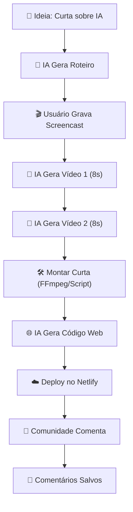

# 🚀 O Prompt Inicial - Como Tudo Começou

Este documento preserva o **prompt original** que inspirou o projeto **trabalh.ai**.

---

## 📌 O Prompt que Deu Origem a Tudo

```
Quero um roteiro para um curta metragem sobre o trabalho da IA.
Ele terá até 2 minutos, com gravações de tela e vídeos gerados por IA.

JANELA 1: Uma IA estrutura o roteiro completo.

JANELA 2: Uma IA gera um vídeo de 5 segundos para entrar no meio do filme.

JANELA 3: Uma IA gera um vídeo de 8 segundos para encerrar o filme.

JANELA 4: Uma IA produz a trilha sonora que deve terminar antes dos 
8 segundos finais (deixando espaço para o áudio do vídeo de encerramento).

JANELA 5: Uma IA explica como montar tudo com um script que:
- Recebe a gravação de tela (gravada automaticamente como "Gravação de Tela...")
- Pergunta o timestamp de quando termina a primeira parte (antes do vídeo de 5s)
- Pergunta quando começa a segunda parte (após o vídeo de 5s)
- Calcula a compressão necessária para encaixar tudo em exatamente 2 minutos
- Monta: [Tela Parte 1] + [Vídeo 5s] + [Tela Parte 2] + [Trilha Sonora] + [Vídeo 8s]
- Gera arquivo final comprimido e otimizado para rodar na página

JANELA 6: Uma IA cria o código de uma página web onde:
- O filme ocupa ⅔ da tela como background contínuo (sem player tradicional)
- No ⅓ inferior à esquerda: campo para comentários
- No ⅓ inferior à direita: carrossel tipográfico animado com os comentários

JANELA 7: Uma IA indica o caminho mais simples para colocar tudo online,
mencionando GitHub e Netlify.
```

### Evolução: Do Prompt Original ao MetaPrompt

O projeto evoluiu de um prompt prático para um **metaPrompt** poético:

> O criador liga sua máquina e abre a pasta mil.IA. Ao iniciar, ele acende 
> a primeira janela, habitada por uma voz que entende de estrutura...
> 
> [Ele passa por 7 janelas, cada uma uma IA diferente, cada uma contribuindo 
> sua parte, até que tudo se torne um filme ao vivo.]

Esta descrição captura a essência: **IA como ferramenta colaborativa, onde 
humano coordena e cada "janela" oferece sua expertise.**

---

## 📊 Análise do Prompt

### Estrutura
Este prompt segue um **fluxo de 5 etapas** bem definido:

| Etapa | Saída Esperada | Status |
|-------|----------------|--------|
| 1️⃣ | Roteiro do curta | ✅ Realizado |
| 2️⃣ | Primeiro vídeo IA (8s) | ✅ Realizado pelo usuário |
| 3️⃣ | Segundo vídeo IA (8s) | ✅ Realizado pelo usuário |
| 4️⃣ | Script CLI para montagem | ℹ️ Fora do escopo (CLI macOS) |
| 5️⃣ | Página web interativa | ✅ Realizado |

### Características Principais

✅ **Multi-step workflow** - Processo em 5 etapas
✅ **Integração IA** - Uso estratégico de IA em cada fase
✅ **Produção audiovisual** - Combinação de screencast + vídeo gerado
✅ **Web interativa** - Página com sistema de comentários
✅ **Design thoughtful** - Especificações claras de layout (2/3 + 1/3)
✅ **Comunidade** - Foco em comentários e engajamento

---

## 🎯 O que Foi Realizado

### ✅ Etapa 1: Roteiro
- IA pode gerar roteiros criativos
- O usuário grava seguindo o roteiro

### ✅ Etapa 2-3: Vídeos Gerados por IA
- Usuário usa ferramentas como:
  - Runway ML
  - Midjourney
  - Luma AI
  - Pika 1.0
- Gera 2 vídeos de 8 segundos

### ℹ️ Etapa 4: Script CLI de Montagem
- **Fora do escopo** deste repositório
- Requer ferramentas específicas:
  - FFmpeg (linha de comando)
  - Script shell (.sh)
- O usuário pode usar:
  - Adobe Premiere
  - Final Cut Pro
  - DaVinci Resolve
  - FFmpeg + shell scripts

### ✅ Etapa 5: Página Web (100% Realizada)
- HTML5 semântico
- CSS3 responsivo
- JavaScript puro (sem dependências)
- Vídeo como background (2/3 da tela)
- Campo de comentários (1/3 da tela, esquerda)
- Carrossel de comentários (1/3 da tela, direita)
- Backend seguro com Netlify Functions
- Persistência de dados com JSONBin.io

---

## 🔄 O Fluxo de Criação



---

## 💡 Conceitos-Chave Envolvidos

### 1. Prompt Engineering
- Comunicação efetiva com IA
- Especificações claras
- Fluxo estruturado

### 2. Produção Audiovisual
- Screencast (gravação de tela)
- Vídeo gerado por IA
- Montagem e sincronização

### 3. Web Design
- Layout responsivo (2/3 + 1/3)
- Tipografia refinada
- Animações suaves

### 4. Backend & Segurança
- API REST
- Variáveis de ambiente
- Proteção de dados

### 5. DevOps & Deployment
- Git/GitHub
- Netlify
- CI/CD automático

---

## 🎓 Lições Aprendidas

### Para Criadores
1. **IA como ferramenta colaborativa** - Não substitui, amplifica criatividade
2. **Prompt claro é essencial** - Detalhes geram melhores resultados
3. **Multimodalidade** - Combinar texto, vídeo, interatividade
4. **Comunidade engaja** - Comentários criam conexão

### Para Desenvolvedores
1. **Full-stack real** - Frontend + Backend + DevOps
2. **Security by design** - Pensar em segurança desde o início
3. **User experience** - Design não é só visual
4. **Automation** - Deploy automático economiza tempo

### Para Product Managers
1. **Requisitos bem definidos** - Especificações claras
2. **Priorização** - MVP primeiro (web + comentários)
3. **Escalabilidade** - Pensar no crescimento futuro
4. **Documentação** - Essencial para colaboração

---

## 🔮 Inspiração para Projetos Similares

Este prompt pode inspirar:

### Variação 1: E-Learning
```
Curta sobre como usar IA no design gráfico
+ Sistema de comentários
+ Quiz de avaliação
```

### Variação 2: Marketing
```
Vídeos de case studies
+ Comentários de clientes
+ CTA interativo
```

### Variação 3: Documentário
```
Série de curtas sobre profissões + IA
+ Comunidade de discussão
+ Sistema de rankings
```

### Variação 4: Educação
```
Aulas em vídeo
+ Comentários com Q&A
+ Sistema de progresso
```

---

## 📚 Recursos Relacionados

### Para Gerar Roteiros com IA
- ChatGPT / Claude
- Jasper AI
- Copy.ai

### Para Gerar Vídeos (8 segundos)
- **Runway ML** - Geração de vídeo por texto
- **Midjourney** - Imagens animadas
- **Luma AI** - Vídeos de IA
- **Pika 1.0** - Gerador de vídeo

### Para Screencast (Gravação de Tela)
- **ScreenFlow** (macOS)
- **OBS Studio** (gratuito, multiplataforma)
- **Camtasia** (profissional)

### Para Montagem
- **FFmpeg** - CLI poderosa (gratuito)
- **Adobe Premiere** - Profissional
- **DaVinci Resolve** - Gratuito + pago
- **Final Cut Pro** - macOS

### Para Deploy
- **Netlify** - Simples e intuitivo
- **Vercel** - Focado em performance
- **GitHub Pages** - Básico

---

## 🎬 Fluxo Técnico Final

```
┌─────────────────────┐
│   PROMPT INICIAL    │
│  (Este documento)   │
└──────────┬──────────┘
           │
    ┌──────┴──────┬──────────┬──────────┬──────────┐
    │             │          │          │          │
    ▼             ▼          ▼          ▼          ▼
┌────────┐  ┌────────┐  ┌─────────┐  ┌──────┐  ┌──────┐
│Roteiro │  │ScreenC │  │Vídeo IA │  │Video │  │Página│
│  (IA)  │  │  ast   │  │  (8s)   │  │IA(8s)│  │ Web  │
└────┬───┘  └────┬───┘  └────┬────┘  └──┬───┘  └──┬───┘
     │           │            │           │        │
     └───────────┴────────────┴───────────┘        │
                      │                            │
                      ▼                            ▼
              ┌──────────────────┐        ┌─────────────────┐
              │  FFmpeg Script   │        │  Netlify Deploy │
              │   (Montagem)     │        │  (Em produção)  │
              └────────┬─────────┘        └────────┬────────┘
                       │                          │
                       └──────────┬───────────────┘
                                  │
                                  ▼
                          ┌─────────────────┐
                          │  Curta Final    │
                          │  Online + Vivo  │
                          │   Com Público   │
                          └─────────────────┘
```

---

## 🌟 Por que Este Prompt é Especial?

1. **Estrutura Clara** - 5 passos bem definidos
2. **Ambição Realista** - Alcançável com ferramentas existentes
3. **Criatividade** - Combina múltiplas tecnologias
4. **Comunidade** - Foco em engajamento
5. **Documentação** - Este prompt é auto-explicativo

---

## 🚀 Próximas Evoluções

### Curto Prazo
- [ ] Adicionar múltiplos curtas
- [ ] Diretório de projetos
- [ ] Showcase de criações

### Médio Prazo
- [ ] Gerador automático de curtas (via API)
- [ ] Template marketplace
- [ ] Comunidade de criadores

### Longo Prazo
- [ ] Plataforma completa (YouTube met IA)
- [ ] App mobile
- [ ] Monetização para criadores

---

## 📝 Reflexão Final

Este projeto demonstra que:

✅ **IA não substitui criatividade** - amplifica
✅ **Bons prompts geram bons resultados** - sempre
✅ **Tecnologia serve o criador** - não o contrário
✅ **Comunidade é importante** - comentários criam valor
✅ **Documentação é essencial** - para entender o processo

---

## 🎯 Use Este Prompt Como Base

Se você quer criar algo similar:

1. **Copie a estrutura** - 5 etapas bem definidas
2. **Adapte para seu domínio** - Educação? Marketing? Arte?
3. **Especifique tecnologias** - Qual IA? Qual plataforma?
4. **Documente bem** - Como este arquivo
5. **Compartilhe** - A comunidade aprende

---

## 📞 Perguntas Frequentes

### P: Posso usar este prompt para outro projeto?
**R**: Sim! É licença aberta. Créditos são apreciados.

### P: Como melhorar este prompt?
**R**: Adicione mais detalhes, especificidades, restrições.

### P: Por que IA em cada etapa?
**R**: IA é ferramenta, não protagonista. Humano lidera criatividade.

### P: Qual IA é melhor para roteiros?
**R**: ChatGPT, Claude, ou qualquer LLM bom funciona.

### P: E para gerar vídeos?
**R**: Runway, Midjourney, ou Pika são as mais acessíveis.

---

## 🎬 Conclusão

Este prompt original capturou uma visão:

> **"Usar inteligência artificial como ferramenta colaborativa para explorar a própria natureza do trabalho de IA, através da linguagem audiovisual, criando conexão com uma comunidade."**

Simplificando: **IA criando sobre IA, para pessoas aprenderem sobre IA.**

Uma mise-en-abyme criativa! 🎭

---

**Data**: Novembro 2025  
**Origem**: Prompt engenheirado por usuário criativo  
**Status**: ✅ Projeto realizado com sucesso  
**Compartilhe**: Este documento é open source
